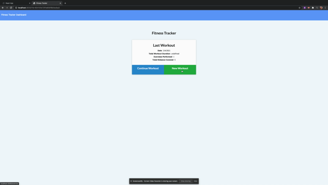

# FitnessTracker

## Description

### [Deployed to Heroku](https://fitness-tracker-0304.herokuapp.com/)

### [Repository on Github](https://github.com/ktcwn/FitnessTracker)

## About

> This applications allows users to enter in workouts (both resistance and cardio) and upload the exercises to the dashboard utilizing Node and Express.js.

## Installation

> First run "npm install" to install all other dependencies needed

### [Node](https://nodejs.org/en/)

> Install using `npm i node`

### [Express](https://expressjs.com/)

> Install using `npm i express`

### [Mongoose](https://www.npmjs.com/package/uuidv4)

> Install using `npm i mongoose`

### [Morgan](https://www.npmjs.com/package/uuidv4)

> Install using `npm i morgan`

## Test Commands

- To initialize the app, open the Fitness Tracker application in a new terminal, enter `node server.js` and navigate to local host address defined in the command shell.
- Example: `http://localhost:3000`
## Contributions

- Starter Code
- Calvin Carter, Instructor
- Tyler Bolty, Tutor
- Traversy Media

## License

© Katelynn Cowan

Licensed under MIT License
